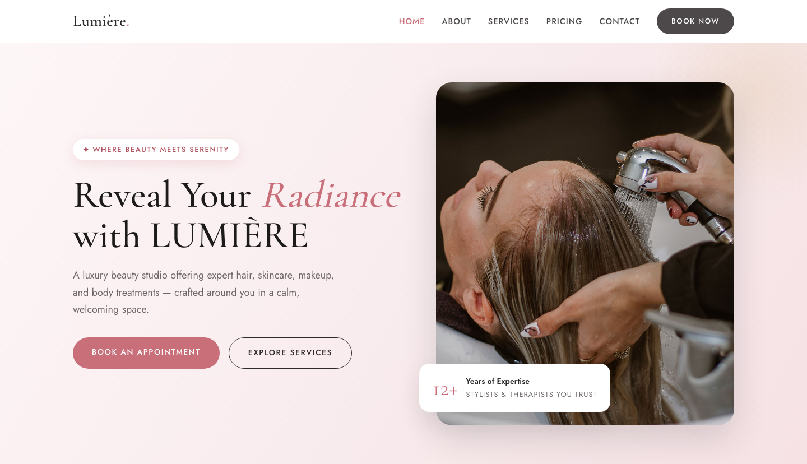

# 🌸 LUMIÈRE — Beauty Salon Template

A premium, framework-free HTML template for beauty salons and spas. The design features a rose + charcoal palette, elegant serif typography, and a calm, sophisticated atmosphere that communicates luxury and care.

## 📸 Screenshot

## 🎨 Design System

| Token | Value | Usage |
|-------|-------|-------|
| `--rose` | `#C96F7A` | CTA, accents, logo |
| `--gold` | `#C9A45C` | Star ratings, dark-section accents |
| `--blush` | `#F8EAEC` | Soft backgrounds, sections |
| `--charcoal` | `#2E2A2B` | Body text, dark buttons |
| `--ink` | `#1C1A1B` | Dark footer, headings |
| Headings | Cormorant Garamond | Elegant serif, italic accent |
| Body | Jost | Clean geometric sans |

## 📄 Pages

| Page | Description | Sections |
|------|-------------|----------|
| [index.html](index.html) | Home — hero with salon photo | Services grid (6), About split, Stats bar, Team (4), Testimonials (3), CTA |
| [about.html](about.html) | Company story | Story split, Values cards, Stats |
| [services.html](services.html) | Full treatment list | 9 service cards with pricing |
| [pricing.html](pricing.html) | Packages & pricing | 3 pricing tiers (Quick Glow, Full Glam, Bridal Luxe), Gift cards |
| [contact.html](contact.html) | Booking / contact | Form (name, email, phone, service, date, message), Contact card with hours |

## ⚙️ Tech Stack

- **HTML5** — semantic markup, accessibility-first
- **CSS3** — custom properties, Grid, Flexbox, `clamp()`, `aspect-ratio`
- **Vanilla JS** — IntersectionObserver, mobile nav, form validation
- **Fonts** — Google Fonts (Cormorant Garamond + Jost)

## 📁 Images

All images from the original Salone template (`Salone/img/`) — 20 files in `assets/img/` including service icons (haircut, makeup, skin-care, manicure, massage, pedicure), team photos, testimonials, and hero backgrounds.

---

**Template by uiuxlabz** — framework-free, responsive, production-ready.